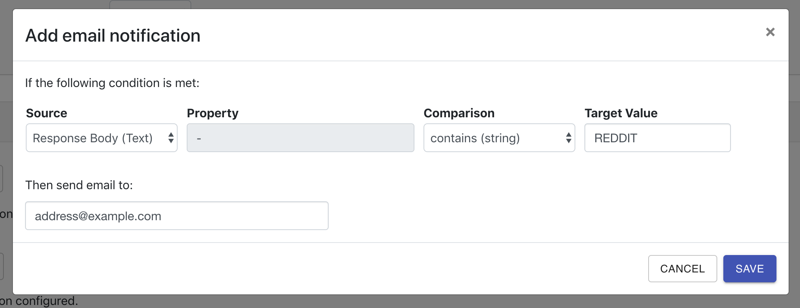

You may optionally configure notifications (email, Slack, custom HTTP) for your iHook task. Each time when an HTTP request is completed by your task, the resposne condition will be evaluated. When the condition is evaluated to `true`, notifications will be sent. The condition is a combination of [Source](/docs/source), [Property](/docs/property), [Comparison](/docs/comparison), and Target Value:

