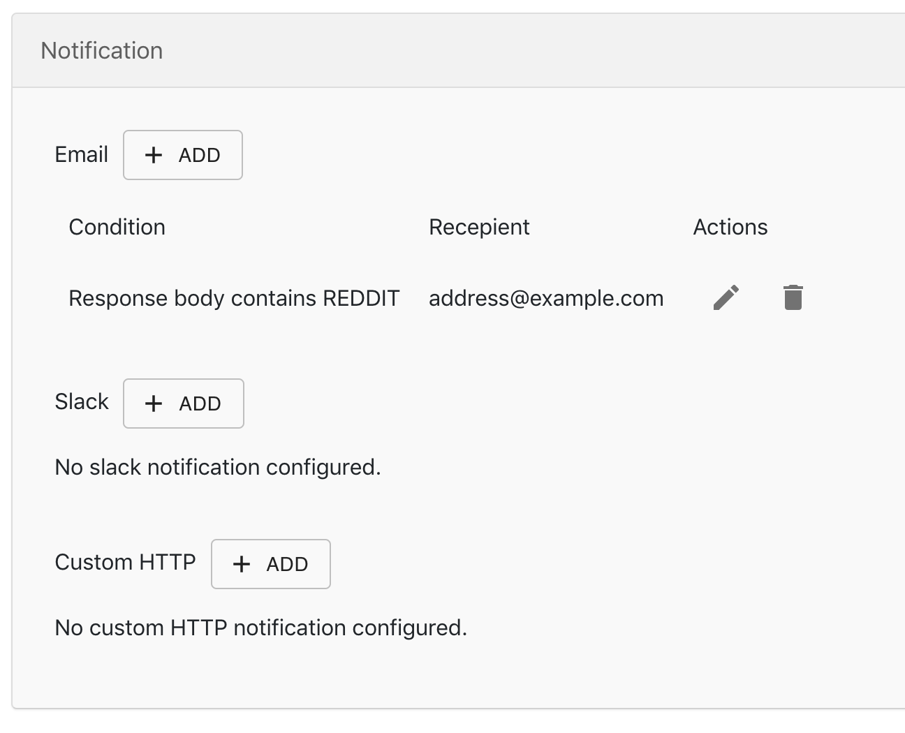

iHook task allows you to schedule HTTP requests, and receive notifications based on response condition. This tutorial will show you how to setup an iHook task, to monitor Reddit's IPO event.

## 1. Setup HTTP request
After signing into iHook dashboard, click the `Create task` button at the top left corner. Then you will see the task creation form. 

Under the `General Settings` section, provide the following values.

|Field|Value|Notes|
|-----|-----|-----|
|Name|Reddit IPO alert|The name of the task (optional), we'll use Reddit as an example|
|URL|https://api.nasdaq.com/api/calendar/upcoming|Nasdaq stock exchange API for upcoming IPOs|
|Request Method|GET||
|Custom Headers|None|No headers are needed|
|Basic Auth|Disabled|No Basic Auth is needed since API is public|
|Schedule|Every 1 day|The task will run once every day|

With this setup, you are tell the task to issue a `GET` request to Nasdaq's IPO API once every day. 

## 2. Setup notification
Then let us setup the notification condition, so we can be alerted when Reddit is going public. We'll choose email channel in this example, but you can also receive notification via Slack, or via custom HTTP channel. Under the `Notification` section, click on `ADD` button next to `Email` label, a notification setup dialog will show up:

Then provide the following values:
|Field|Value|Notes|
|-----|-----|-----|
|Source|`Response Body (Text)`|Parse the response body as plain text|
|Property|N/A|No property will be specified when source is `Response Body (Text)`|
|Comparison|`contains (string)`|Check if target value can be found (case sensitive) in response body|
|Target Value|`REDDIT`|Check if `REDDIT` (all capital letters) can be found in resposne body|
|Email|address@example.com|The email address to receive notification when condition evaluates to `true`|

Click `Save`, you will see the new notification appear under the `Notification` section:

## 3. Save & Test task
Now your task setup is ready, click `Save` at the bottom of the task creation form. Then you'll see your task has been created and in `ACTIVE` status:

Now you might be wondering: how do I make sure my HTTP and notification settings are properly configured, so I won't miss the Reddit IPO event when it actually happens? This is when `TEST` button becomes helpful. The `TEST` button will trigger the HTTP request right away, and send notifications when the configured conditions are met. Now let us use the upcoming IPO data at the moment to test our task.

First visit the URL `https://api.nasdaq.com/api/calendar/upcoming` in your browser, you will see the upcoming IPO list:

Looks like `CHURCHILL CAPITAL` is going public soon, let us use that as a test data. First go back to your newly created iHook task, let us create a new email notification that checks for `CHURCHILL CAPITAL` string:

Then click `SAVE`. Now, our task will be able to send out an email notification when keyword `CHURCHILL CAPITAL` is in the API response. Let us see that in action. Now click `TEST` at the top of the page, the task page will switch to `History` view, to check the HTTP request status in real-time, within a couple of seconds, you should see the execution status turned into `COMPLETED`:

At this point, you should receive an email notification triggered by the task:

Nice! Looks like our notification logic is correct, now you can delete the test email notification by clicking the trash can icon:

Congratulations! You've successfully setup your first iHook task as an Reddit IPO alert! For more advanced notification setup, please continue to next page.